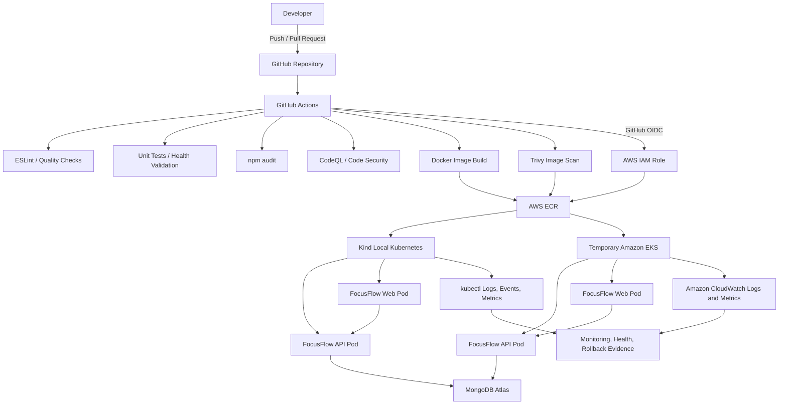
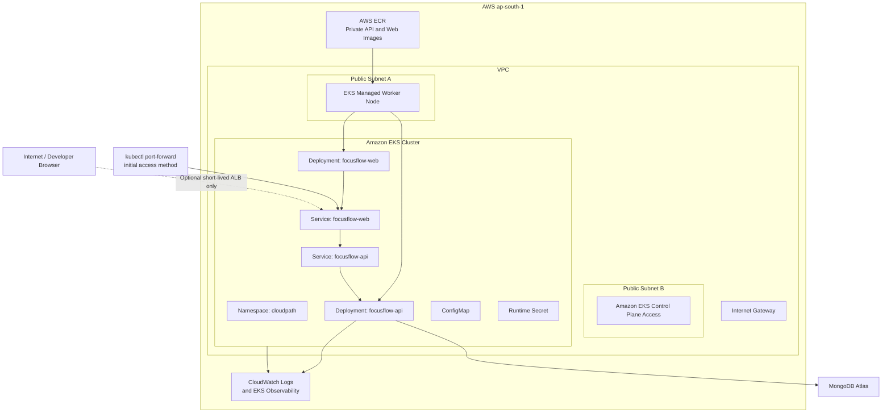
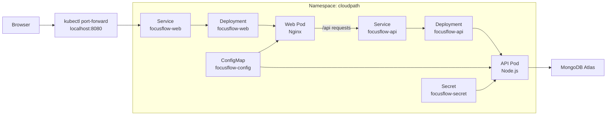
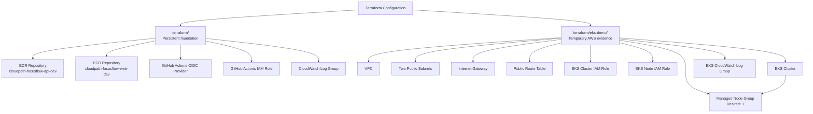
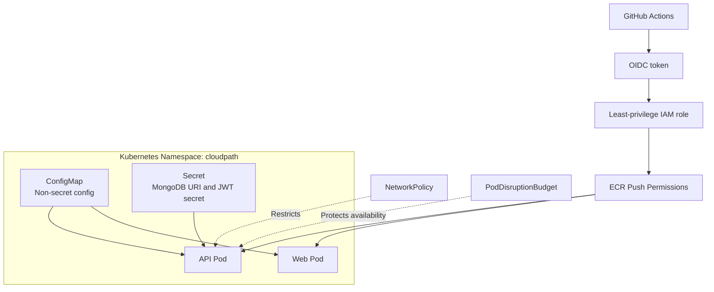
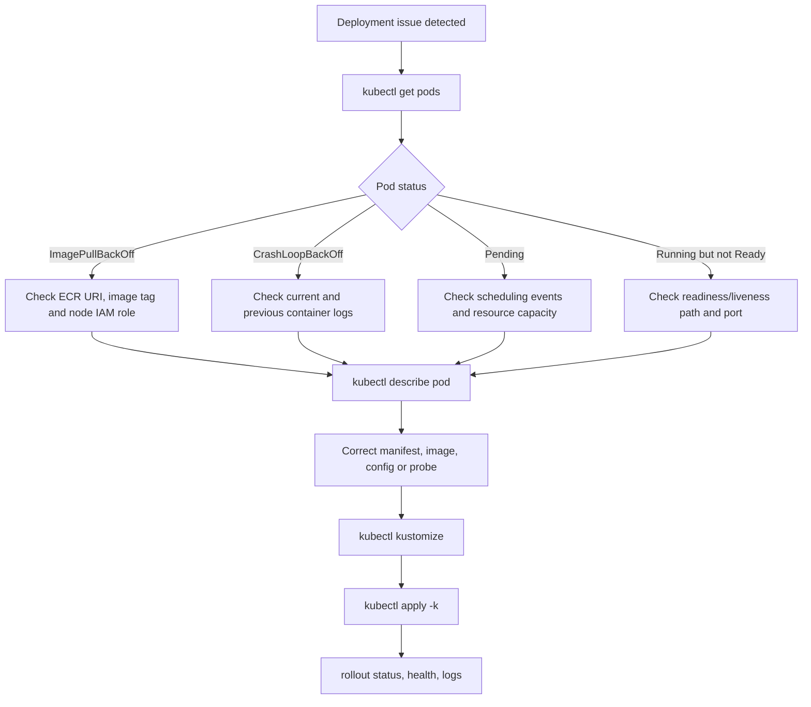

# CloudPath FocusFlow

**A DevSecOps delivery platform for a containerised FocusFlow application**

CloudPath FocusFlow demonstrates a complete, evidence-driven DevOps workflow for a small full-stack application. It takes application code from GitHub through automated quality and security checks, Docker image builds, private Amazon ECR publication, Kubernetes deployment, monitoring, controlled release updates, and rollback verification.

The project was developed as an individual CloudPath DevOps Engineer internship project. Its goal is not only to deploy an application, but to show that the deployment is repeatable, observable, secure by default, and recoverable when a release fails.

> [!IMPORTANT]
> This repository contains example configuration and secret templates only. Never commit `.env` files, `terraform.tfvars`, Terraform state, AWS credentials, MongoDB connection strings, JWT secrets, or Kubernetes Secret values.

## Table of Contents

- [Project Overview](#project-overview)
- [Problem Statement](#problem-statement)
- [Project Objectives](#project-objectives)
- [Key Capabilities](#key-capabilities)
- [Architecture](#architecture)
- [Technology Stack](#technology-stack)
- [Repository Structure](#repository-structure)
- [Delivery Pipeline](#delivery-pipeline)
- [Application Components](#application-components)
- [Prerequisites](#prerequisites)
- [Quick Start](#quick-start)
- [Environment Configuration](#environment-configuration)
- [Docker Workflow](#docker-workflow)
- [Kubernetes Deployment](#kubernetes-deployment)
- [AWS ECR and EKS Showcase](#aws-ecr-and-eks-showcase)
- [Terraform Infrastructure](#terraform-infrastructure)
- [CI/CD and Security](#cicd-and-security)
- [Monitoring and Operations](#monitoring-and-operations)
- [Release and Rollback](#release-and-rollback)
- [Troubleshooting](#troubleshooting)
- [Evidence Map](#evidence-map)
- [Security and Cost Controls](#security-and-cost-controls)
- [Known Limitations](#known-limitations)
- [Final Demonstration](#final-demonstration)
- [Project Information](#project-information)
- [Generative AI Declaration](#generative-ai-declaration)
- [License](#license)

---

## Project Overview

FocusFlow is a containerised web application consisting of:

- A Node.js API service with a health endpoint.
- A frontend web application served through Nginx.
- MongoDB Atlas as the external database service.
- Docker images for portable and repeatable execution.
- Kubernetes manifests for local Kind and temporary Amazon EKS deployment.
- Terraform infrastructure-as-code for AWS ECR, GitHub Actions OIDC, CloudWatch, and a temporary EKS demonstration environment.
- GitHub Actions workflows for code quality, testing, security checks, image publishing, and release evidence.

### Project summary

| Item | Details |
|---|---|
| Project name | CloudPath FocusFlow |
| Project type | Individual DevOps / DevSecOps delivery platform |
| Application type | Containerised API and frontend web application |
| Primary goal | Demonstrate a secure, repeatable, observable application delivery workflow |
| Source control | Git and GitHub |
| CI/CD platform | GitHub Actions |
| Container registry | Amazon Elastic Container Registry (ECR) |
| Kubernetes platforms | Kind for local verification; Amazon EKS for temporary cloud evidence |
| Infrastructure as code | Terraform |
| Database | MongoDB Atlas |
| Cloud provider | Amazon Web Services |
| AWS region | `ap-south-1` |
| Kubernetes namespace | `cloudpath` |
| Author | Nadeeshan R. M. K. |
| Internship | CCA DevOps Engineer — CloudPath |

### Core delivery story

```text
Developer change
    ↓
Git branch and pull request
    ↓
GitHub Actions quality and security checks
    ↓
Docker API and frontend image build
    ↓
Trivy image scan
    ↓
GitHub OIDC authentication to AWS
    ↓
Immutable Git-SHA images pushed to Amazon ECR
    ↓
Kubernetes deployment to Kind or temporary Amazon EKS
    ↓
Health checks, logs, rollout verification and rollback evidence
```

---

## Problem Statement

Manual deployments create inconsistent environments, delayed releases, unclear ownership, weak secret handling, and difficult recovery when failures occur.

A developer may have working application code, but the operational path from source code to a secure, observable deployment can still be incomplete:

- Docker images may not be reproducible.
- Dependencies or security issues may be discovered late.
- Image versions may not be traceable to source commits.
- Kubernetes deployments may fail without clear logs or probes.
- Secrets may be handled unsafely.
- Recovery procedures may not be documented or tested.
- Cloud resources may create unnecessary cost without lifecycle controls.

CloudPath FocusFlow addresses these problems by treating Git as the source of truth and connecting code quality, image security, cloud registry publication, Kubernetes deployment, monitoring, and rollback evidence into one workflow.

---

## Project Objectives

- Containerise the FocusFlow API and frontend using Docker.
- Use immutable image tags based on the Git commit SHA.
- Run automated checks through GitHub Actions.
- Include linting, tests, dependency audit, code scanning, and image scanning.
- Publish approved images to private Amazon ECR repositories.
- Deploy the application through Kubernetes manifests.
- Use a namespace, Deployments, Services, ConfigMap, Secret reference, probes, resource settings, NetworkPolicy, and PodDisruptionBudget.
- Support local Kubernetes verification with Kind.
- Demonstrate real AWS skills using Terraform, ECR, IAM OIDC, CloudWatch, and temporary Amazon EKS evidence.
- Capture logs, health checks, rollout status, troubleshooting steps, and rollback proof.
- Avoid exposing secrets and control AWS cost through limited, temporary infrastructure.

---

## Key Capabilities

### Application delivery

- API health endpoint exposed at `/health`.
- Frontend application served through an Nginx container.
- Configurable application settings through environment variables and Kubernetes ConfigMaps.
- Sensitive configuration injected through a Kubernetes Secret created outside Git.

### Containerisation

- Dedicated Dockerfiles for the API and frontend.
- `.dockerignore` files to reduce unnecessary build context.
- Local Docker build and health-check evidence.
- Image tags based on Git commit SHA for traceability.
- Private image storage in Amazon ECR.

### Continuous integration and security

- ESLint and application quality checks.
- Unit tests / health validation.
- Dependency vulnerability checks using `npm audit`.
- Code scanning through CodeQL or equivalent workflow.
- Container vulnerability scanning through Trivy.
- Dependabot configuration for dependency update visibility.
- GitHub Actions OIDC authentication to AWS instead of storing long-lived AWS access keys.

### Kubernetes operations

- Dedicated Kubernetes namespace: `cloudpath`.
- API and frontend Deployments.
- Internal ClusterIP Services.
- ConfigMap for non-secret runtime configuration.
- Secret reference for MongoDB URI and JWT secret.
- HTTP readiness and liveness probes.
- Resource requests and limits.
- NetworkPolicy and PodDisruptionBudget.
- Kustomize base/overlay organisation for environment-specific configuration.
- Rollout, rollback, Pod logs, events, and health-check evidence.

### AWS and infrastructure as code

- Terraform-managed Amazon ECR repositories.
- Terraform-managed GitHub Actions OIDC provider and IAM role.
- Terraform-managed CloudWatch Log Group.
- Terraform EKS demonstration configuration with:
  - VPC
  - Public subnets
  - Internet Gateway
  - Route table
  - IAM roles
  - EKS control plane
  - One managed node group
  - CloudWatch control-plane logs
- Temporary EKS deployment for cloud-native evidence.
- Cost controls that intentionally exclude live NAT Gateway and RDS resources.

---

## Architecture

### End-to-end delivery architecture



### Low-cost AWS deployment architecture

The temporary AWS deployment was designed to show real cloud and Kubernetes skills while avoiding unnecessary long-running cost.



### Kubernetes workload architecture



### Terraform architecture



### Security boundary diagram



---

## Technology Stack

| Area | Technology |
|---|---|
| Version control | Git and GitHub |
| Application API | Node.js application |
| Frontend | JavaScript frontend served by Nginx |
| Database | MongoDB Atlas |
| Containerisation | Docker and Docker Desktop |
| Container scanning | Trivy |
| Dependency checks | npm audit |
| Static/code scanning | CodeQL and security workflow |
| CI/CD | GitHub Actions |
| Cloud authentication | GitHub Actions OIDC with AWS IAM |
| Image registry | Amazon ECR |
| Local Kubernetes | Kind |
| Cloud Kubernetes | Amazon EKS |
| Kubernetes configuration | YAML and Kustomize |
| Infrastructure as code | Terraform |
| Cloud logging | Amazon CloudWatch |
| AWS region | `ap-south-1` |
| Development environment | Windows + WSL 2 / Linux shell |
| Documentation diagrams | Mermaid |

---

## Repository Structure

```text
cloudpath-focusflow/
├── app/                              # FocusFlow API application
│   ├── src/
│   │   ├── config/
│   │   ├── controllers/
│   │   ├── middleware/
│   │   ├── models/
│   │   ├── routes/
│   │   └── ...
│   ├── tests/
│   ├── Dockerfile
│   ├── Dockerfile.dev
│   ├── Dockerfile.bookworm
│   ├── package.json
│   └── ...
│
├── frontend/                         # FocusFlow frontend application
│   ├── src/
│   ├── public/
│   ├── Dockerfile
│   ├── Dockerfile.k8s
│   ├── nginx*.conf
│   ├── package.json
│   └── ...
│
├── .github/
│   ├── workflows/
│   │   ├── ci.yml                    # Quality, test, build workflow
│   │   ├── codeql.yml                # Code security analysis
│   │   ├── security.yml              # Security checks
│   │   └── publish-ecr.yml           # ECR publication workflow
│   └── dependabot.yml
│
├── k8s/
│   ├── base/                         # Shared Kubernetes resources
│   │   ├── namespace.yaml
│   │   ├── configmap.yaml
│   │   ├── deployment.yaml
│   │   ├── service.yaml
│   │   ├── frontend-deployment.yaml
│   │   ├── frontend-service.yaml
│   │   ├── network-policy.yaml
│   │   ├── pod-disruption-budget.yaml
│   │   ├── patches/
│   │   └── kustomization.yaml
│   │
│   ├── overlays/
│   │   └── eks/                      # EKS-specific ECR image and config patches
│   │       ├── api-image-patch.yaml
│   │       ├── web-image-patch.yaml
│   │       ├── configmap-patch.yaml
│   │       └── kustomization.yaml
│   │
│   ├── secret.example.yaml            # Safe template only
│   ├── secret.local.yaml              # Local only; ignored by Git
│   └── deployment-broken-probe.yaml   # Controlled troubleshooting/failure evidence
│
├── terraform/
│   ├── modules/
│   │   └── ecr/                       # Reusable ECR module
│   ├── bootstrap/                     # Optional bootstrap configuration
│   ├── eks-demo/                      # Temporary EKS showcase infrastructure
│   │   ├── versions.tf
│   │   ├── provider.tf
│   │   ├── variables.tf
│   │   ├── vpc.tf
│   │   ├── iam.tf
│   │   ├── eks.tf
│   │   ├── cloudwatch.tf
│   │   ├── outputs.tf
│   │   ├── security-groups.tf
│   │   └── terraform.tfvars.example
│   ├── cloudwatch.tf
│   ├── oidc.tf
│   ├── variables.tf
│   ├── outputs.tf
│   └── ...
│
├── scripts/
│   ├── release-kind.sh
│   ├── rollback-kind.sh
│   └── ...
│
├── docs/
│   ├── aws-final-week-cost-control.md
│   ├── aws-eks-troubleshooting.md
│   ├── aws-final-week-summary.md
│   ├── releases/
│   └── ...
│
├── evidence/
│   ├── week-*/
│   ├── final-release/
│   └── aws-final/
│
├── compose.yaml
├── compose.dev.yaml
├── .env.example
├── .gitignore
├── README.md
└── package.json
```

> [!NOTE]
> The exact file list may evolve as the project is maintained. Use `find . -maxdepth 3 -type f` for the current repository inventory.

---

## Delivery Pipeline

### Recommended application flow

```text
Developer
   |
   | git checkout feature/...
   | git commit
   | git push
   v
GitHub Repository
   |
   | Pull request / push event
   v
GitHub Actions
   ├── Dependency installation
   ├── ESLint / format checks
   ├── API tests and health validation
   ├── Frontend build
   ├── npm audit
   ├── CodeQL / security checks
   ├── Docker API build
   ├── Docker frontend build
   ├── Trivy image scan
   └── GitHub OIDC authentication
          |
          v
Amazon ECR
   ├── cloudpath-focusflow-api-dev:<git-sha>
   └── cloudpath-focusflow-web-dev:<git-sha>
          |
          v
Kubernetes Deployment
   ├── Kind: local repeatable verification
   └── Amazon EKS: temporary AWS evidence
          |
          v
Operational Evidence
   ├── kubectl get pods
   ├── kubectl logs
   ├── kubectl events
   ├── /health response
   ├── rollout status
   ├── rollback status
   └── CloudWatch logs / Container Insights where enabled
```

### Image versioning policy

Images are tagged with a short Git commit SHA:

```text
cloudpath-focusflow-api-dev:<git-sha>
cloudpath-focusflow-web-dev:<git-sha>
```

Example:

```text
797989098577.dkr.ecr.ap-south-1.amazonaws.com/cloudpath-focusflow-api-dev:18cbf70
797989098577.dkr.ecr.ap-south-1.amazonaws.com/cloudpath-focusflow-web-dev:18cbf70
```

Using immutable commit tags provides traceability:

```text
Git commit
    ↓
GitHub Actions workflow
    ↓
Docker image tag
    ↓
ECR image digest
    ↓
Kubernetes Deployment image reference
    ↓
Rollout / rollback history
```

Avoid deploying only `latest` in production-style workflows because it makes the deployed version ambiguous.

---

## Application Components

### API service

The API service is responsible for application logic, database communication, authentication-related functionality, and health reporting.

Expected runtime behaviour:

```text
- Reads non-secret settings from environment variables.
- Reads sensitive values through Kubernetes Secret injection.
- Logs operational information to stdout.
- Exposes /health for liveness and readiness verification.
- Connects to MongoDB Atlas using MONGODB_URI.
```

Example health check:

```bash
curl -i http://localhost:5000/health
```

Expected result:

```text
HTTP/1.1 200 OK
```

### Frontend service

The frontend is built into static assets and served by Nginx.

For Kubernetes, the frontend should either:

1. Call the API through a relative `/api` path and use an internal Nginx proxy, or
2. Use an explicitly configured API URL appropriate for the deployed environment.

The preferred Kubernetes traffic flow is:

```text
Browser
  ↓
focusflow-web Service
  ↓
Nginx frontend Pod
  ↓ /api
focusflow-api Service
  ↓
FocusFlow API Pod
```

This avoids exposing the API directly to the browser during initial internal-service deployments.

### MongoDB Atlas

MongoDB Atlas is used as the managed database service. The database connection URI is treated as a secret:

```text
MONGODB_URI
```

It must be supplied through a local `.env` file for development or through a Kubernetes Secret at runtime.

Never commit a real MongoDB URI.

---

## Prerequisites

Install and configure the following tools before running the full project.

| Tool | Purpose | Check command |
|---|---|---|
| Git | Source control | `git --version` |
| Node.js | Application build/runtime | `node --version` |
| npm | Dependency management | `npm --version` |
| Docker Desktop / Docker Engine | Container build and run | `docker version` |
| kubectl | Kubernetes management | `kubectl version --client` |
| Kind | Local Kubernetes cluster | `kind version` |
| Terraform | Infrastructure as code | `terraform version` |
| AWS CLI | AWS and EKS/ECR interaction | `aws --version` |
| Trivy | Container scanning if used locally | `trivy --version` |
| WSL 2 or Linux shell | Recommended Windows shell environment | `wsl -l -v` |

### Docker Desktop and WSL 2

For Windows with WSL 2:

1. Start Docker Desktop.
2. Enable the WSL 2 engine.
3. Enable Docker Desktop integration for the WSL distribution used for this project.
4. Open a new WSL terminal.
5. Verify:

```bash
docker version
docker run --rm hello-world
```

---

## Quick Start

### 1. Clone the repository

```bash
git clone <REPLACE_WITH_GITHUB_REPOSITORY_URL>
cd cloudpath-focusflow
```

### 2. Create local environment files

Copy the example configuration:

```bash
cp .env.example .env
```

Create API environment configuration if the API uses a separate file:

```bash
cp app/.env.example app/.env
```

Update values locally. Do not commit these files.

### 3. Install dependencies

API:

```bash
cd app
npm ci
```

Frontend:

```bash
cd ../frontend
npm ci
```

### 4. Run the application locally

Use the repository’s current development workflow.

For example:

```bash
docker compose -f compose.dev.yaml up --build
```

Or, when supported:

```bash
docker compose up --build
```

### 5. Verify API health

```bash
curl -i http://localhost:5000/health
```

### 6. Stop local services

```bash
docker compose down
```

> [!NOTE]
> Confirm the actual local ports in `compose.yaml`, `compose.dev.yaml`, and application configuration before running commands. The API health endpoint is expected at `/health`.

---

## Environment Configuration

### Example environment variables

Use variable names only in committed example files.

```dotenv
NODE_ENV=development
PORT=5000

MONGODB_URI=
JWT_SECRET=

CORS_ORIGIN=http://localhost:8080
```

The real variables in use are determined by `app/src/config/env.js`, application source, Docker Compose configuration, and Kubernetes manifests.

### Secret-handling rules

- Do not commit `.env`, `app/.env`, `terraform.tfvars`, or Terraform state.
- Do not commit Kubernetes Secret values.
- Do not include tokens, database URIs, or JWT values in screenshots.
- Do not run `kubectl get secret ... -o yaml` in terminal recordings or evidence.
- Use `k8s/secret.example.yaml` only as a non-sensitive template.
- Create the runtime secret imperatively or through a secure secret-management mechanism.

### Kubernetes runtime secret

Create the EKS/Kind runtime secret locally:

```bash
kubectl create namespace cloudpath \
  --dry-run=client \
  -o yaml \
  | kubectl apply -f -
```

```bash
kubectl -n cloudpath create secret generic focusflow-secret \
  --from-literal=MONGODB_URI='YOUR_MONGODB_ATLAS_URI' \
  --from-literal=JWT_SECRET='YOUR_LONG_RANDOM_JWT_SECRET'
```

If it already exists, update safely:

```bash
kubectl -n cloudpath create secret generic focusflow-secret \
  --from-literal=MONGODB_URI='YOUR_MONGODB_ATLAS_URI' \
  --from-literal=JWT_SECRET='YOUR_LONG_RANDOM_JWT_SECRET' \
  --dry-run=client \
  -o yaml \
  | kubectl apply -f -
```

Verify only metadata:

```bash
kubectl -n cloudpath get secret focusflow-secret
```

---

## Docker Workflow

### Build API image

From repository root:

```bash
docker build \
  --tag focusflow-api:local \
  --file app/Dockerfile \
  app
```

### Build frontend image

Use the frontend Dockerfile appropriate to the selected deployment approach:

```bash
docker build \
  --tag focusflow-web:local \
  --file frontend/Dockerfile \
  frontend
```

If the project uses the Kubernetes-specific frontend Dockerfile:

```bash
docker build \
  --tag focusflow-web:local \
  --file frontend/Dockerfile.k8s \
  frontend
```

### Run API image locally

Example only; use valid local environment values:

```bash
docker run --rm \
  --name focusflow-api-local \
  -p 5000:5000 \
  -e PORT=5000 \
  -e NODE_ENV=production \
  -e MONGODB_URI='YOUR_TEST_MONGODB_URI' \
  -e JWT_SECRET='LOCAL_TEST_VALUE' \
  focusflow-api:local
```

In another terminal:

```bash
curl -i http://localhost:5000/health
```

### Run frontend image locally

```bash
docker run --rm \
  --name focusflow-web-local \
  -p 8080:80 \
  focusflow-web:local
```

Open:

```text
http://localhost:8080
```

### Scan images with Trivy

Example local scan:

```bash
trivy image focusflow-api:local
```

```bash
trivy image focusflow-web:local
```

The GitHub Actions workflow also performs container security scanning as part of the delivery pipeline.

---

## Kubernetes Deployment

### Kubernetes resources

| Resource | Name | Purpose |
|---|---|---|
| Namespace | `cloudpath` | Isolates FocusFlow Kubernetes resources |
| API Deployment | `focusflow-api` | Runs the Node.js API container |
| API Service | `focusflow-api` | Provides stable in-cluster API access |
| Web Deployment | `focusflow-web` | Runs the Nginx frontend container |
| Web Service | `focusflow-web` | Provides stable in-cluster frontend access |
| ConfigMap | `focusflow-config` | Holds non-secret runtime configuration |
| Secret | `focusflow-secret` | Supplies MongoDB URI and JWT secret |
| NetworkPolicy | API policy | Limits network access according to project policy |
| PodDisruptionBudget | API PDB | Adds availability protection during voluntary disruptions |

### Kustomize structure

```text
k8s/
├── base/
│   ├── kustomization.yaml
│   ├── namespace.yaml
│   ├── configmap.yaml
│   ├── deployment.yaml
│   ├── service.yaml
│   ├── frontend-deployment.yaml
│   ├── frontend-service.yaml
│   ├── network-policy.yaml
│   └── pod-disruption-budget.yaml
│
└── overlays/
    └── eks/
        ├── kustomization.yaml
        ├── api-image-patch.yaml
        ├── web-image-patch.yaml
        └── configmap-patch.yaml
```

The base contains shared Kubernetes objects. The EKS overlay applies environment-specific changes, particularly immutable Amazon ECR image references and production-oriented runtime configuration.

### Render manifests before deployment

Render base resources:

```bash
kubectl kustomize k8s/base > rendered-base.yaml
```

Render EKS resources:

```bash
kubectl kustomize k8s/overlays/eks > rendered-eks.yaml
```

Confirm image references:

```bash
grep -n "image:" rendered-eks.yaml
```

Expected output should show ECR image URIs with SHA tags.

### Deploy to local Kind

Create a Kind cluster if required:

```bash
kind create cluster --name cloudpath
```

Create/update secret:

```bash
kubectl create namespace cloudpath \
  --dry-run=client \
  -o yaml \
  | kubectl apply -f -
```

```bash
kubectl -n cloudpath create secret generic focusflow-secret \
  --from-literal=MONGODB_URI='YOUR_MONGODB_ATLAS_URI' \
  --from-literal=JWT_SECRET='YOUR_LONG_RANDOM_JWT_SECRET' \
  --dry-run=client \
  -o yaml \
  | kubectl apply -f -
```

Deploy base manifests:

```bash
kubectl apply -k k8s/base
```

Check status:

```bash
kubectl -n cloudpath get pods -o wide
kubectl -n cloudpath get services
kubectl -n cloudpath get events --sort-by=.lastTimestamp
```

Verify API rollout:

```bash
kubectl -n cloudpath rollout status deployment/focusflow-api
```

Verify frontend rollout:

```bash
kubectl -n cloudpath rollout status deployment/focusflow-web
```

### Access local Kubernetes deployment

Port-forward the frontend service:

```bash
kubectl -n cloudpath port-forward service/focusflow-web 8080:80
```

Open:

```text
http://localhost:8080
```

Test API health directly:

```bash
kubectl -n cloudpath port-forward service/focusflow-api 5000:5000
```

Then:

```bash
curl -i http://localhost:5000/health
```

### Inspect application logs

```bash
kubectl -n cloudpath logs deployment/focusflow-api --tail=100
```

```bash
kubectl -n cloudpath logs deployment/focusflow-web --tail=100
```

---

## AWS ECR and EKS Showcase

> [!WARNING]
> Amazon EKS, EC2 worker nodes, CloudWatch logs, and load balancers can incur AWS charges. The EKS environment was designed as a short-lived evidence environment and must be destroyed after the demonstration.

### Amazon ECR repositories

Terraform provisions private repositories:

```text
cloudpath-focusflow-api-dev
cloudpath-focusflow-web-dev
```

Verify repository creation:

```bash
aws ecr describe-repositories \
  --region ap-south-1 \
  --query 'repositories[*].{Name:repositoryName,URI:repositoryUri,ScanOnPush:imageScanningConfiguration.scanOnPush}' \
  --output table
```

### Build and tag ECR images

```bash
export AWS_REGION="ap-south-1"
export AWS_ACCOUNT_ID="$(aws sts get-caller-identity --query Account --output text)"
export ECR_REGISTRY="${AWS_ACCOUNT_ID}.dkr.ecr.${AWS_REGION}.amazonaws.com"

export API_REPOSITORY="cloudpath-focusflow-api-dev"
export WEB_REPOSITORY="cloudpath-focusflow-web-dev"

export IMAGE_TAG="$(git rev-parse --short HEAD)"

export API_IMAGE="${ECR_REGISTRY}/${API_REPOSITORY}:${IMAGE_TAG}"
export WEB_IMAGE="${ECR_REGISTRY}/${WEB_REPOSITORY}:${IMAGE_TAG}"

echo "${API_IMAGE}"
echo "${WEB_IMAGE}"
```

Build:

```bash
docker build \
  --tag "${API_IMAGE}" \
  --file app/Dockerfile \
  app
```

```bash
docker build \
  --tag "${WEB_IMAGE}" \
  --file frontend/Dockerfile \
  frontend
```

Use `frontend/Dockerfile.k8s` or an EKS-specific Dockerfile only if that is the validated frontend container configuration.

### Authenticate Docker to ECR

```bash
aws ecr get-login-password \
  --region "${AWS_REGION}" \
  | docker login \
      --username AWS \
      --password-stdin "${ECR_REGISTRY}"
```

Expected:

```text
Login Succeeded
```

### Push images

```bash
docker push "${API_IMAGE}"
docker push "${WEB_IMAGE}"
```

### Verify ECR image metadata

```bash
aws ecr describe-images \
  --region "${AWS_REGION}" \
  --repository-name "${API_REPOSITORY}" \
  --image-ids imageTag="${IMAGE_TAG}" \
  --query 'imageDetails.{Tags:imageTags,Digest:imageDigest,PushedAt:imagePushedAt,Size:imageSizeInBytes}' \
  --output table
```

```bash
aws ecr describe-images \
  --region "${AWS_REGION}" \
  --repository-name "${WEB_REPOSITORY}" \
  --image-ids imageTag="${IMAGE_TAG}" \
  --query 'imageDetails.{Tags:imageTags,Digest:imageDigest,PushedAt:imagePushedAt,Size:imageSizeInBytes}' \
  --output table
```

### Configure kubectl for EKS

After the EKS cluster exists:

```bash
aws eks update-kubeconfig \
  --region ap-south-1 \
  --name cloudpath-focusflow-final
```

Verify:

```bash
kubectl config current-context
kubectl get nodes -o wide
```

### Deploy EKS overlay

Create the runtime secret:

```bash
kubectl create namespace cloudpath \
  --dry-run=client \
  -o yaml \
  | kubectl apply -f -
```

```bash
kubectl -n cloudpath create secret generic focusflow-secret \
  --from-literal=MONGODB_URI='YOUR_MONGODB_ATLAS_URI' \
  --from-literal=JWT_SECRET='YOUR_LONG_RANDOM_JWT_SECRET' \
  --dry-run=client \
  -o yaml \
  | kubectl apply -f -
```

Validate server-side:

```bash
kubectl apply --dry-run=server -k k8s/overlays/eks
```

Deploy:

```bash
kubectl apply -k k8s/overlays/eks
```

Verify:

```bash
kubectl -n cloudpath rollout status deployment/focusflow-api --timeout=300s
kubectl -n cloudpath rollout status deployment/focusflow-web --timeout=300s

kubectl -n cloudpath get pods -o wide
kubectl -n cloudpath get services
kubectl -n cloudpath get events --sort-by=.lastTimestamp
```

### EKS image-pull proof

A successful EKS image pull proves that:

```text
- The ECR repository exists.
- The image tag exists.
- The EKS managed node can authenticate to ECR.
- The node IAM role has required ECR read permissions.
- The Kubernetes Deployment references a valid immutable ECR image.
```

Useful diagnostic command:

```bash
kubectl -n cloudpath describe pod <POD_NAME>
```

Look for:

```text
Successfully pulled image ...
```

### CloudWatch observability

EKS control-plane logs are enabled through Terraform. CloudWatch Observability / Container Insights may be installed temporarily for additional workload metrics and logs.

Check EKS add-ons:

```bash
aws eks list-addons \
  --cluster-name cloudpath-focusflow-final \
  --region ap-south-1
```

Create the CloudWatch Observability add-on when required:

```bash
aws eks create-addon \
  --cluster-name cloudpath-focusflow-final \
  --addon-name amazon-cloudwatch-observability \
  --region ap-south-1
```

Check status:

```bash
aws eks describe-addon \
  --cluster-name cloudpath-focusflow-final \
  --addon-name amazon-cloudwatch-observability \
  --region ap-south-1 \
  --query 'addon.{Name:addonName,Version:addonVersion,Status:status,CreatedAt:createdAt}' \
  --output table
```

### EKS cleanup

Delete application resources first:

```bash
kubectl delete -k k8s/overlays/eks
```

Delete the runtime secret:

```bash
kubectl -n cloudpath delete secret focusflow-secret
```

Destroy temporary EKS resources:

```bash
cd terraform/eks-demo

terraform plan -destroy
terraform destroy
```

Verify no temporary resources remain:

```bash
aws eks list-clusters --region ap-south-1
```

```bash
aws ec2 describe-nat-gateways \
  --region ap-south-1 \
  --query 'NatGateways[*].[NatGatewayId,State,VpcId]' \
  --output table
```

```bash
aws elbv2 describe-load-balancers \
  --region ap-south-1 \
  --query 'LoadBalancers[*].[LoadBalancerName,State.Code,Type]' \
  --output table
```

---

## Terraform Infrastructure

### Persistent foundation

The root Terraform configuration manages low-cost, persistent delivery foundation resources:

```text
Amazon ECR repositories
GitHub Actions OIDC provider
GitHub Actions IAM role and permissions
CloudWatch Log Group
ECR lifecycle policies
Outputs for repository URLs and AWS configuration
```

Run from `terraform/`:

```bash
cd terraform

terraform fmt -recursive
terraform init
terraform validate
terraform plan
```

### Temporary EKS showcase

The `terraform/eks-demo/` configuration manages a temporary cloud demonstration environment:

```text
VPC
Two public subnets
Internet Gateway
Public route table
EKS cluster role
EKS managed-node role
EKS cluster
One managed node group
CloudWatch EKS log group
```

Run:

```bash
cd terraform/eks-demo

terraform fmt -recursive
terraform init
terraform validate
terraform plan
```

Apply only after reviewing the plan:

```bash
terraform apply
```

### Required plan review

Before any EKS apply, confirm the plan includes:

```text
- VPC
- Two public subnets
- Internet Gateway
- Route table
- IAM roles and policy attachments
- EKS cluster
- One managed node group
- CloudWatch log group
```

Confirm it does **not** include:

```text
- NAT Gateway
- RDS instance
- Permanent Application Load Balancer
- Multiple managed node groups
- Standalone EC2 instance resources
```

### Terraform state and secret safety

Never commit:

```text
terraform.tfvars
terraform.tfstate
terraform.tfstate.*
.terraform/
```

Use `terraform.tfvars.example` as a safe variable template.

---

## CI/CD and Security

### GitHub Actions workflows

| Workflow | Purpose |
|---|---|
| `ci.yml` | Dependency installation, linting, tests, build validation |
| `security.yml` | Security and dependency checks |
| `codeql.yml` | Static code analysis / CodeQL |
| `publish-ecr.yml` | Authenticates through GitHub OIDC and publishes images to ECR |
| `dependabot.yml` | Dependency update configuration |

### GitHub OIDC to AWS

GitHub Actions authenticates to AWS through OpenID Connect (OIDC).

```text
GitHub Actions job
    ↓ short-lived OIDC token
AWS IAM OIDC provider
    ↓ trust policy validation
IAM role: cloudpath-focusflow-dev-github-ecr
    ↓ least-privilege permissions
Amazon ECR image push
```

Benefits:

- No long-lived AWS access keys stored in GitHub repository secrets.
- Short-lived role credentials.
- Repository/branch constraints can be enforced in the IAM trust policy.
- Access can be limited to ECR actions required for publishing images.

### CI/CD workflow stages

```mermaid
flowchart LR
    A[Checkout] --> B[Install dependencies]
    B --> C[Lint]
    C --> D[Test]
    D --> E[npm audit]
    E --> F[CodeQL / security checks]
    F --> G[Build API image]
    G --> H[Build web image]
    H --> I[Trivy scan]
    I --> J[Assume AWS role with OIDC]
    J --> K[Authenticate Docker to ECR]
    K --> L[Push SHA-tagged images]
```



### Security baseline

- No real secrets committed to Git.
- `.env.example` contains variable names only.
- Kubernetes Secret values are not committed.
- Terraform local state and variable files are ignored.
- Docker images are scanned with Trivy.
- Dependencies are audited.
- Code scanning is configured.
- ECR image tags use immutable Git SHA values.
- Node IAM permissions include only required ECR pull permissions.
- GitHub Actions uses OIDC rather than permanent credentials.
- Kubernetes network restrictions are defined using NetworkPolicy.
- Resource requests and limits help reduce noisy-neighbour behaviour.
- AWS resources are time-boxed and cleaned up after evidence collection.

---

## Monitoring and Operations

### Minimum operational checks

```bash
kubectl -n cloudpath get pods -o wide
```

```bash
kubectl -n cloudpath get services
```

```bash
kubectl -n cloudpath get events --sort-by=.lastTimestamp
```

```bash
kubectl -n cloudpath logs deployment/focusflow-api --tail=100
```

```bash
kubectl -n cloudpath logs deployment/focusflow-web --tail=100
```

```bash
kubectl -n cloudpath top pods
```

> [!NOTE]
> `kubectl top` requires metrics-server or an equivalent metrics pipeline. If it is unavailable, record this clearly and retain Pod, event, health, and log evidence.

### Health checks

API health check:

```bash
kubectl -n cloudpath port-forward service/focusflow-api 5000:5000
```

In another terminal:

```bash
curl -i http://localhost:5000/health
```

Frontend access check:

```bash
kubectl -n cloudpath port-forward service/focusflow-web 8080:80
```

Then open:

```text
http://localhost:8080
```

### CloudWatch checks

For EKS:

```bash
aws logs describe-log-groups \
  --region ap-south-1 \
  --log-group-name-prefix "/aws" \
  --query 'logGroups[*].{Name:logGroupName,Retention:retentionInDays}' \
  --output table
```

CloudWatch evidence may include:

- EKS control-plane log group.
- API log streams where observability add-on/log shipping is enabled.
- Container Insights cluster overview.
- Node metrics.
- Pod metrics.
- CloudWatch add-on status.

### Operational alert/failure note

A production-grade monitoring system would include alert rules and notification channels. For the internship scope, the project demonstrates operational awareness through:

```text
- Liveness and readiness probes.
- Health endpoint validation.
- Kubernetes Events.
- Pod restart counts.
- Application logs.
- CloudWatch logs and optional Container Insights.
- A documented failure, diagnosis and remediation workflow.
```

---

## Release and Rollback

### Release flow

```text
1. Deploy a known working version (v1).
2. Verify Pod status and /health.
3. Capture deployed image reference.
4. Deploy a new immutable image tag or version (v2).
5. Check rollout status.
6. Verify logs and health.
7. If an issue occurs, rollback to the previous revision.
8. Confirm the restored image and health response.
```

### Inspect current image

```bash
kubectl -n cloudpath get deployment focusflow-api \
  -o jsonpath='{.spec.template.spec.containers.image}{"\n"}'
```

```bash
kubectl -n cloudpath get deployment focusflow-web \
  -o jsonpath='{.spec.template.spec.containers.image}{"\n"}'
```

### Deploy an update

Apply an updated Kustomize configuration:

```bash
kubectl apply -k k8s/overlays/eks
```

Watch API rollout:

```bash
kubectl -n cloudpath rollout status deployment/focusflow-api --timeout=300s
```

Watch frontend rollout:

```bash
kubectl -n cloudpath rollout status deployment/focusflow-web --timeout=300s
```

### Rollout history

```bash
kubectl -n cloudpath rollout history deployment/focusflow-api
```

```bash
kubectl -n cloudpath rollout history deployment/focusflow-web
```

### Roll back API

```bash
kubectl -n cloudpath rollout undo deployment/focusflow-api
```

Verify:

```bash
kubectl -n cloudpath rollout status deployment/focusflow-api --timeout=300s
```

### Roll back frontend

```bash
kubectl -n cloudpath rollout undo deployment/focusflow-web
```

Verify:

```bash
kubectl -n cloudpath rollout status deployment/focusflow-web --timeout=300s
```

### Kind helper scripts

The repository includes helper scripts for local release and rollback evidence:

```bash
./scripts/release-kind.sh
```

```bash
./scripts/rollback-kind.sh
```

Inspect a script before running it:

```bash
sed -n '1,260p' scripts/release-kind.sh
sed -n '1,260p' scripts/rollback-kind.sh
```

---

## Troubleshooting

### Troubleshooting workflow



### Common commands

Check Pods:

```bash
kubectl -n cloudpath get pods -o wide
```

Describe a Pod:

```bash
kubectl -n cloudpath describe pod <POD_NAME>
```

View current logs:

```bash
kubectl -n cloudpath logs <POD_NAME>
```

View logs from previous failed container instance:

```bash
kubectl -n cloudpath logs <POD_NAME> --previous
```

View recent events:

```bash
kubectl -n cloudpath get events --sort-by=.lastTimestamp
```

### Frontend probe incident

During temporary EKS evidence collection, the API deployed successfully while the frontend Deployment initially failed to reach an Available state.

Observed symptoms included:

```text
focusflow-web: 0/1 Ready
CrashLoopBackOff
Liveness probe failed
dial tcp <pod-ip>:<port>: connect: connection refused
```

The investigation used:

```bash
kubectl -n cloudpath get pods -o wide
kubectl -n cloudpath describe pod <web-pod>
kubectl -n cloudpath logs <web-pod>
kubectl -n cloudpath logs <web-pod> --previous
kubectl -n cloudpath get events --sort-by=.lastTimestamp
aws ecr describe-images --repository-name cloudpath-focusflow-web-dev
```

The ECR digest shown by Kubernetes matched the ECR digest, proving that image publication and node image-pull permissions were functioning. The issue was isolated to frontend container/probe configuration rather than AWS ECR access.

This incident is retained as evidence of practical troubleshooting:

```text
ECR image pull
    ↓ successful
Nginx container start
    ↓
Kubernetes probe connection failure
    ↓
CrashLoopBackOff / unavailable Deployment
    ↓
Describe + logs + events
    ↓
Configuration correction and redeployment
```

See:

```text
docs/aws-eks-troubleshooting.md
evidence/aws-final/
```

> [!IMPORTANT]
> Only describe the frontend incident as “resolved” in final documentation if the repository contains final evidence showing a successful frontend rollout after the correction.

---

## Evidence Map

The repository stores command output, screenshots, release proof, and troubleshooting evidence in `evidence/`.

| Area | Evidence location | Examples |
|---|---|---|
| Docker | `evidence/week-*` or `evidence/aws-final/` | Local build, container run, `/health`, Trivy output |
| CI/CD | GitHub Actions + workflow files | Successful workflow, failed/fixed workflow, scan logs |
| Kubernetes | `evidence/week-*` | Pods, Services, logs, events, port-forward |
| Terraform | `terraform/evidence/`, `evidence/aws-final/` | `fmt`, `validate`, `plan`, outputs |
| Release | `evidence/final-release/` | v1/v2 images, rollouts, rollback status, health |
| AWS ECR | `evidence/aws-final/` | Repository metadata, image tag, digest, push proof |
| AWS EKS | `evidence/aws-final/` | Cluster, nodes, Pod deployment, CloudWatch |
| Monitoring | `evidence/aws-final/` | CloudWatch, Container Insights, application logs |
| Cost control | `docs/aws-final-week-cost-control.md` | Budget, resource limits, destroy proof |
| Troubleshooting | `docs/aws-eks-troubleshooting.md` | Probe failure diagnosis and remediation |

### Recommended final evidence inventory

```text
evidence/
├── week-02/
│   ├── Docker build output
│   ├── Local container health check
│   └── Trivy scan result
│
├── week-03/
│   ├── GitHub Actions successful run
│   ├── GitHub Actions failed/fixed evidence
│   └── Security scan output
│
├── week-04/
│   ├── Kubernetes Pods and Services
│   ├── Application logs
│   └── Port-forward/browser proof
│
├── week-05/
│   ├── Terraform fmt
│   ├── Terraform validate
│   └── Terraform plan
│
├── final-release/
│   ├── v1 rollout evidence
│   ├── v2 rollout evidence
│   ├── rollback evidence
│   ├── image version proof
│   └── final health evidence
│
└── aws-final/
    ├── ECR repository and image verification
    ├── Docker build and ECR push evidence
    ├── EKS node and workload evidence
    ├── CloudWatch / Container Insights evidence
    ├── EKS troubleshooting evidence
    ├── EKS destroy plan and destroy evidence
    └── AWS resource cleanup verification
```

---

## Security and Cost Controls

### Security controls

| Control | Implementation |
|---|---|
| Secret exclusion | `.env`, Kubernetes local Secret files, Terraform variable/state files are ignored |
| Secret template | `k8s/secret.example.yaml` contains placeholders only |
| Runtime secret injection | `focusflow-secret` is created outside Git |
| Dependency checks | `npm audit` in local/CI workflow |
| Static analysis | CodeQL/security workflows |
| Container scanning | Trivy |
| Image traceability | Immutable Git SHA tags |
| Registry access | Private Amazon ECR repositories |
| CI cloud access | GitHub Actions OIDC and IAM role |
| Kubernetes health | Liveness and readiness probes |
| Resource isolation | Kubernetes namespace `cloudpath` |
| Network restriction | NetworkPolicy |
| Availability control | PodDisruptionBudget |
| Infrastructure consistency | Terraform modules, variables, outputs and plans |

### AWS cost controls

| Decision | Reason |
|---|---|
| One EKS managed node group | Limits EC2 worker capacity and cost |
| Desired node count = 1 | Suitable for temporary evidence |
| No NAT Gateway | Avoids hourly NAT Gateway and data processing charges |
| No live RDS | MongoDB Atlas is the active project database |
| No permanent ALB | Port-forward provides low-cost evaluator access |
| Public subnets only for temporary demo | Simplifies short-lived student demonstration |
| CloudWatch log retention | Limits unnecessary log storage |
| EKS environment time-boxed | Cluster is destroyed after evidence collection |
| ECR lifecycle policies | Reduces old image accumulation |
| Budget alerts | Supports early cost visibility |

### Production improvements

A production implementation should improve the temporary demo architecture with:

```text
- Private subnets for worker nodes.
- NAT Gateway or VPC endpoints where appropriate.
- HTTPS through ACM and an Application Load Balancer or API Gateway.
- Managed secrets through AWS Secrets Manager or External Secrets Operator.
- Remote Terraform state using encrypted S3 and DynamoDB locking.
- Separate AWS accounts or environments for development, staging and production.
- Autoscaling/HPA and Cluster Autoscaler or Karpenter.
- Alerting through CloudWatch Alarms, Alertmanager or equivalent.
- Centralised audit logging and stronger IAM boundaries.
- Managed database availability, backup and disaster-recovery planning.
```

---

## Known Limitations

- Amazon EKS was used as a short-lived evidence environment, not a permanent production environment.
- The default low-cost EKS demonstration uses one managed node, so it does not provide real multi-node high availability.
- MongoDB Atlas is externally managed and is not provisioned by Terraform in this project.
- No live NAT Gateway or RDS is created because of cost-control requirements.
- An Application Load Balancer is optional and should be short-lived if created for evidence.
- CloudWatch Container Insights can create additional metric/logging cost and should only be enabled for the required evidence period.
- The frontend Nginx configuration and Kubernetes probes must use aligned ports and paths; this was recorded as a practical deployment troubleshooting scenario.
- The project uses Kubernetes port-forward for initial evaluator access rather than a permanent public ingress endpoint.
- A complete production secret-management integration is a recommended next step.

---

## Final Demonstration

### Suggested live demo order

1. Show the repository structure and architecture diagrams.
2. Explain the developer-to-deployment workflow.
3. Open GitHub Actions and show a successful CI/security run.
4. Show the Dockerfiles and immutable image tag convention.
5. Show Amazon ECR repositories and image digest/tag metadata.
6. Show Terraform directory structure and validated plan evidence.
7. Show Kubernetes Kustomize base and EKS overlay.
8. Show running Kind or EKS Pods and Services.
9. Port-forward the frontend and open the application.
10. Call the API `/health` endpoint.
11. Show application logs and Kubernetes events.
12. Demonstrate a rollout update or show release evidence.
13. Demonstrate rollback or show retained rollback evidence.
14. Show CloudWatch monitoring evidence.
15. Show the troubleshooting incident and explain diagnosis.
16. Show EKS destroy evidence and AWS cleanup verification.
17. Explain cost-control decisions and production improvement path.

### Key commands for demonstration

```bash
# Local Kubernetes status
kubectl -n cloudpath get pods -o wide
kubectl -n cloudpath get services
kubectl -n cloudpath get events --sort-by=.lastTimestamp

# API logs and health
kubectl -n cloudpath logs deployment/focusflow-api --tail=100
kubectl -n cloudpath port-forward service/focusflow-api 5000:5000
curl -i http://localhost:5000/health

# Frontend access
kubectl -n cloudpath port-forward service/focusflow-web 8080:80

# Release history
kubectl -n cloudpath rollout history deployment/focusflow-api
kubectl -n cloudpath rollout history deployment/focusflow-web

# ECR verification
aws ecr describe-images \
  --region ap-south-1 \
  --repository-name cloudpath-focusflow-api-dev \
  --output table
```

---

## Project Information

| Item | Details |
|---|---|
| Project | CloudPath FocusFlow |
| Internship | CCA DevOps Engineer |
| Delivery mode | Individual project |
| Primary objective | Automate a build, deploy a container, monitor the result, and explain the pipeline |
| Repository | `<REPLACE_WITH_GITHUB_REPOSITORY_URL>` |
| GitHub Actions | `<REPLACE_WITH_ACTIONS_URL>` |
| Final report | `<REPLACE_WITH_REPORT_LINK_OR_PATH>` |
| Final presentation | `<REPLACE_WITH_PRESENTATION_LINK_OR_PATH>` |
| Demo video, if applicable | `<REPLACE_WITH_VIDEO_LINK>` |

### Branch strategy

| Branch | Purpose |
|---|---|
| `main` | Stable, reviewed release suitable for final demonstration |
| `develop` | Integrated development branch |
| `feature/<short-description>` | Feature or infrastructure work |
| `fix/<short-description>` | Corrective work and bug fixes |
| `docs/<short-description>` | Documentation-only work |

Example:

```text
feature/aws-eks-final-week
```

### Commit-message style

Use clear, meaningful commits:

```text
feat: add focusflow API health endpoint
ci: add Trivy image security scan
infra: provision ECR and GitHub Actions OIDC role
k8s: add EKS Kustomize overlay
fix: align frontend probe with container port
docs: add AWS EKS troubleshooting evidence
```

---

## Generative AI Declaration

Generative AI tools were used as learning and drafting assistants for:

- Explaining DevOps, AWS, Docker, Kubernetes and Terraform concepts.
- Producing documentation outlines and Mermaid diagram drafts.
- Helping interpret error messages and form troubleshooting plans.
- Reviewing command sequences and suggesting safe evidence collection.
- Improving wording and structure of project documentation.

All generated suggestions, commands, diagrams, configuration examples, and documentation were reviewed, adapted, tested, and understood by the project author before use.

Generative AI was not treated as evidence of completed work. Actual project evidence consists of repository commits, GitHub Actions runs, Docker builds, Terraform plans, ECR metadata, Kubernetes output, CloudWatch records, screenshots, and documented troubleshooting results.

---

## License

This repository was created for an academic DevOps internship project.

No public reuse license has been selected.

**License status: academic project use only unless a license is added later.**
